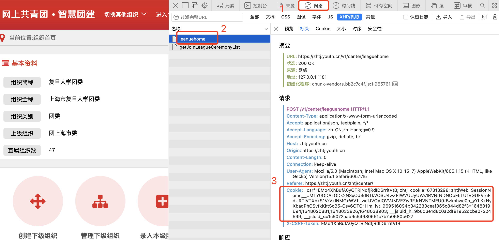

# 复旦大学组织部脚本

## 下载本仓库

    $ git clone https://github.com/Guitenbay/fdu_zzb_script.git
## 安装

    $ cd fdu_zzb_script && npm install

## 0. 更新智慧团建 Cookie 登陆状态

使用 Chrome 浏览器，智慧团建登陆后，打开开发者网络控制台，刷新页面，选择任意一个 `XHR` 请求，在请求头上找到 Cookie，全选复制到 `./COOKIE.json` 的 `COOKIE` 常量的双引号内，替换原来值。

## 1. 生成组织部团组织结构树

### 运行脚本获取团组织树 🌲

    $ npm run tzbtree

> 以上步骤必做

---

## 2. 自动生成组织部团支部人数表

> **首先必须生成组织部团组织结构树**

### 运行脚本获取数据

    $ npm run tzbinfo

### 运行脚本生成表格

1.  生成所有团支部团员人数表

        $ npm run tzbexcel

2.  生成在校学生团支部团员人数表

        $ npm run onschoolexcel

## 3. 自动生成组织部团支部团干部人数表

> **首先必须生成组织部团组织结构树**

### 运行脚本获取数据

    $ npm run tgbinfo

### 运行脚本生成表格

    $ npm run tgbexcel

## 4. 自动生成组织部团支部团员详情表

> **首先必须生成组织部团组织结构树**

### 运行脚本下载每个支部 excel

    $ npm run download_ty_excel

### 运行脚本生成表格

    $ npm run tyexcel

## 5. 自动生成对标定级五星级、四星级团支部表

> **首先必须生成组织部团组织结构树**

### 运行脚本生成表格

    $ npm run dbdjexcel

---

以下是其他功能

## 自动生成组织部成长记录表脚本

    $ cd ./growth_chart

### 更新 Excel

更新 `data.xlsx`（必须按照要求的格式填入，可直接适配问卷星）

### 运行脚本

    $ node index.js
